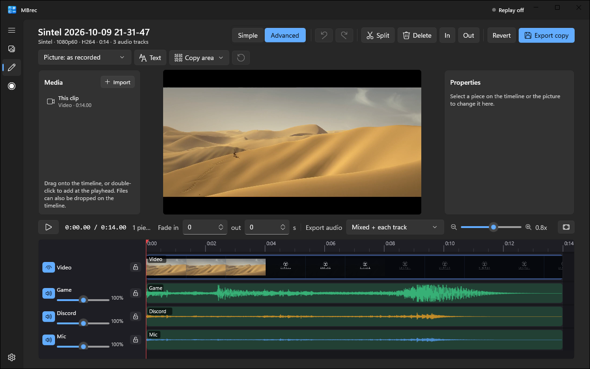
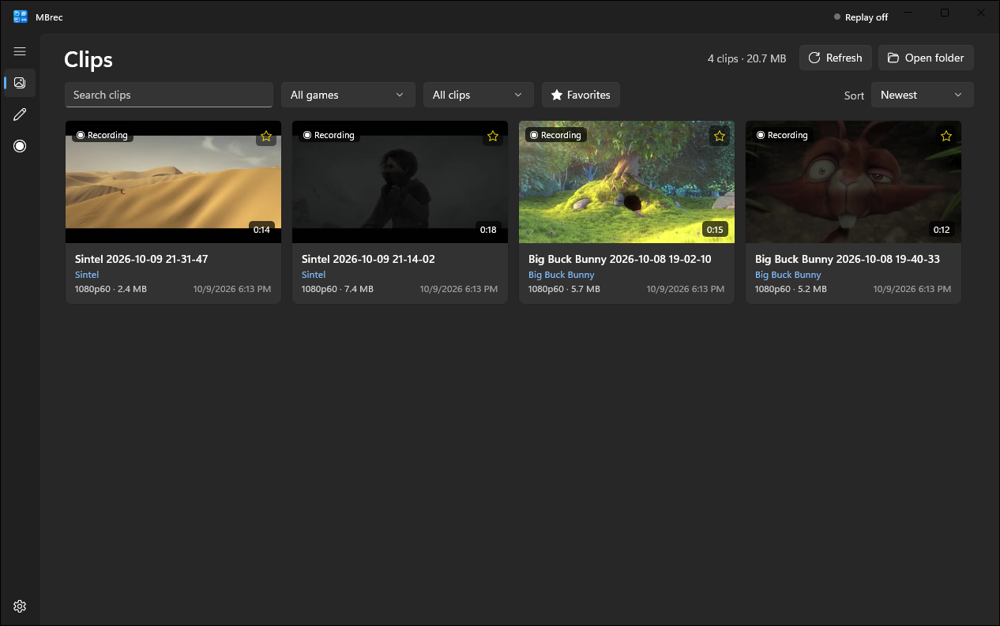
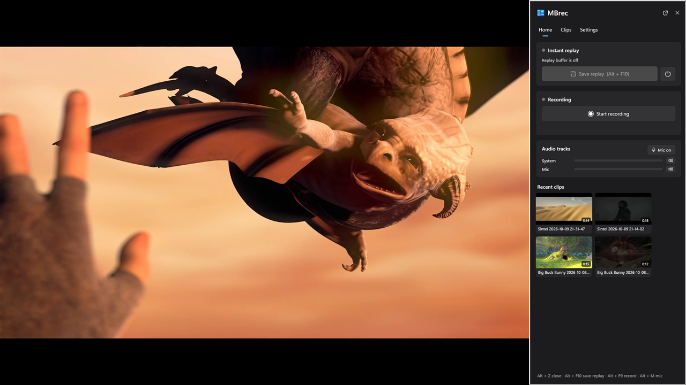
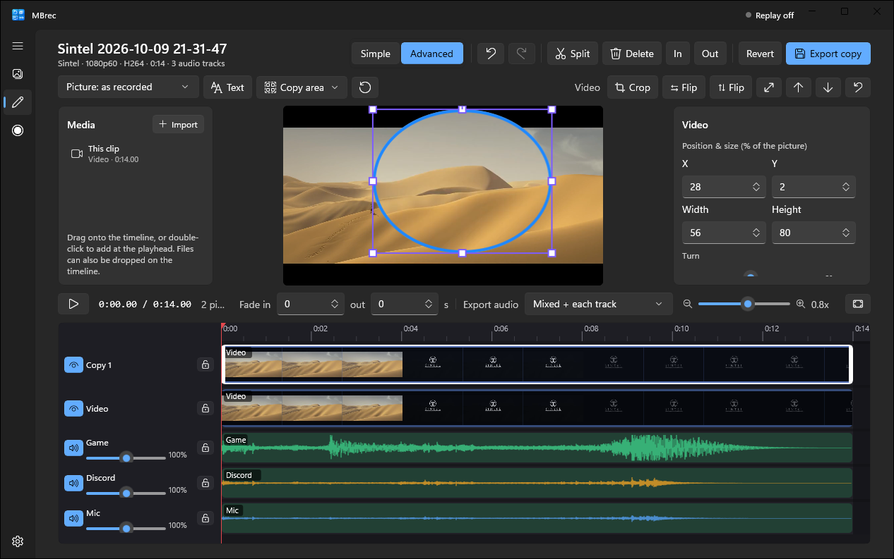
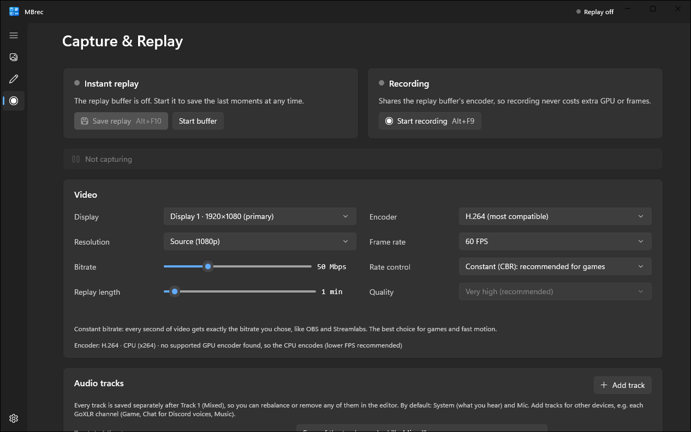
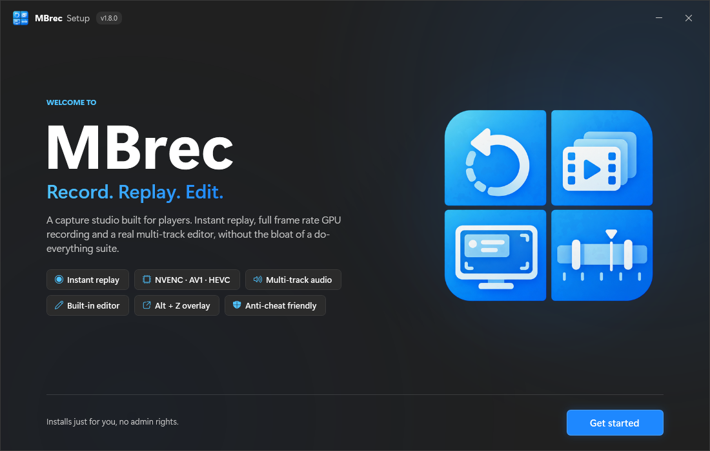

  

  
  
  

  

<b><a href="#english">English</a></b> · <b><a href="#arabic">العربية</a></b>

---

## What is MBrec?

A light, fast Windows app that **keeps the last moments of your game ready to save**, records your screen, and lets you **edit the clip right away** — without slowing your game down.

  

## ✨ Features

| | |
| :--- | :--- |
| ⏪ **Instant replay** | The last minute (or however long you choose) is always on standby. Press **Alt + F10** and it's a clip. |
| 🔴 **Recording** | **Alt + F9** to start and stop. Up to 4K, 120+ fps, on your graphics card (NVIDIA, AMD or Intel). |
| 🎧 **Every voice its own track** | Game, Discord, microphone… each on its own track, plus one mixed track. Mute your mic with **Alt + M**. |
| 🎮 **In-game panel (Alt + Z)** | Save replays, record, see your clips, and change quality, bitrate and hotkeys without leaving the game. |
| ✂️ **Editor — Simple** | Cut, trim, choose start and end, and turn each sound on or off. |
| 🎬 **Editor — Advanced** | Many tracks: add your own videos, music and pictures, move and stretch pieces, speed, fades, text, and right-click menus for everything. |
| 🔍 **Copy area** | Mark part of the video (square, circle, freehand or points) — like the minimap — and show it big on top, perfectly in sync. |
| 📺 **1080p · 2K · 4K** | Real resolutions with a real bitrate slider (10–150 Mbps). |
| 🛡️ **Anti-cheat friendly** | Uses the same Windows methods as ShadowPlay and OBS. No injection, no game hooks, no admin rights. |
| 🔄 **Updates itself** | New versions install from inside the app, with your settings kept. |

  
  

  
  

## 📥 Install

1. Click **[Download for Windows](https://github.com/F2isalq/MBrec-Releases/releases/latest/download/MBrec-Setup.exe)**.
2. Open `MBrec-Setup.exe`. If Windows shows *"Windows protected your PC"*, click **More info → Run anyway**.
3. Pick where to save clips and your hotkeys, and you're done. No admin rights needed.

  

## ⌨️ Default hotkeys

| Keys | Action |
| :---: | :--- |
| <kbd>Alt</kbd> + <kbd>F10</kbd> | Save replay |
| <kbd>Alt</kbd> + <kbd>F9</kbd> | Start / stop recording |
| <kbd>Alt</kbd> + <kbd>Z</kbd> | Open / close the in-game panel |
| <kbd>Alt</kbd> + <kbd>C</kbd> | Open clips |
| <kbd>Alt</kbd> + <kbd>E</kbd> | Edit the latest clip |
| <kbd>Alt</kbd> + <kbd>M</kbd> | Mute / unmute microphone |

Change any of them in **Settings → Hotkeys** or in the **Alt + Z** panel.

> [!TIP]
> The NVIDIA App uses the same keys (Alt + Z, Alt + F9, Alt + F10). Turn off its in-game overlay, or pick other keys in MBrec.

## 🔄 Updates

You never need to come back here. MBrec checks for new versions on its own and shows **"Install and restart"** — one click and it's done, with your settings kept.
You can also check any time from **Settings → Updates**. Every download is checked (SHA-256) before it installs.

What's new in each version: **[Changelog](CHANGELOG.md)** · **[All releases](https://github.com/F2isalq/MBrec-Releases/releases)**

## 💻 Requirements

- Windows 10 (version 2004 or newer) or Windows 11, 64-bit
- Any graphics card — NVIDIA, AMD and Intel are used for fast recording, otherwise the processor does it
- Nothing else to install

## 🐞 Found a problem?

Open MBrec → **Settings → Diagnostics → Copy diagnostic report**, then [open a bug report](https://github.com/F2isalq/MBrec-Releases/issues/new?template=bug_report.yml) and paste it in.

---

## ما هو MBrec؟

برنامج خفيف وسريع لويندوز **يحفظ لك آخر لحظات لعبك جاهزة للحفظ**، يسجل الشاشة، ويخليك **تعدّل الكليب مباشرة** — بدون ما يثقّل على اللعبة.

## ✨ المميزات

- ⏪ **الإعادة الفورية:** آخر دقيقة (أو المدة اللي تختارها) دايم محفوظة. اضغط **Alt + F10** وتصير كليب.
- 🔴 **التسجيل:** **Alt + F9** للبدء والإيقاف. لين 4K و120+ فريم، على كرت الشاشة (NVIDIA أو AMD أو Intel).
- 🎧 **كل صوت بمسار لحاله:** اللعبة، الديسكورد، المايك… كل واحد بمسار، ومسار مدموج. كتم المايك بـ **Alt + M**.
- 🎮 **لوحة داخل اللعبة (Alt + Z):** احفظ، سجّل، شوف كليباتك، وغيّر الجودة والبت ريت والاختصارات بدون ما تطلع من اللعبة.
- ✂️ **المحرر البسيط:** قص، تقصير، تحديد البداية والنهاية، وتشغيل/إطفاء كل صوت.
- 🎬 **المحرر المتقدم:** مسارات متعددة، أضف فيديوهاتك وموسيقاك وصورك، حرّك ومدّد القطع، السرعة، التلاشي، النصوص، وقوائم بالزر اليمين لكل شي.
- 🔍 **نسخ جزء من الفيديو:** حدد جزء (مربع، دائرة، رسم حر أو نقاط) — مثل الخريطة — واعرضه كبير فوق الفيديو ومتزامن تماماً.
- 📺 **1080p · 2K · 4K:** دقة حقيقية مع سلايدر بت ريت حقيقي (10–150 Mbps).
- 🛡️ **آمن مع الأنتي تشيت:** نفس طرق ويندوز اللي يستخدمها ShadowPlay وOBS. بدون حقن، بدون لمس اللعبة، بدون صلاحيات مدير.
- 🔄 **يحدّث نفسه:** النسخ الجديدة تنزل من داخل البرنامج وإعداداتك تبقى.

## 📥 التثبيت

1. اضغط **[Download for Windows](https://github.com/F2isalq/MBrec-Releases/releases/latest/download/MBrec-Setup.exe)**.
2. افتح `MBrec-Setup.exe`. إذا طلع لك *"Windows protected your PC"* اضغط **More info ← Run anyway**.
3. اختر مكان حفظ الكليبات والاختصارات، وخلاص. ما يحتاج صلاحيات مدير.

## ⌨️ الاختصارات الافتراضية

| المفاتيح | الوظيفة |
| :---: | :--- |
| <kbd>Alt</kbd> + <kbd>F10</kbd> | حفظ الإعادة |
| <kbd>Alt</kbd> + <kbd>F9</kbd> | بدء / إيقاف التسجيل |
| <kbd>Alt</kbd> + <kbd>Z</kbd> | فتح / إغلاق اللوحة داخل اللعبة |
| <kbd>Alt</kbd> + <kbd>C</kbd> | فتح الكليبات |
| <kbd>Alt</kbd> + <kbd>E</kbd> | تعديل آخر كليب |
| <kbd>Alt</kbd> + <kbd>M</kbd> | كتم / فتح المايك |

تقدر تغيّرها من **Settings ← Hotkeys** أو من لوحة **Alt + Z**.

> [!TIP]
> برنامج NVIDIA يستخدم نفس المفاتيح (Alt + Z و Alt + F9 و Alt + F10). أطفئ الأوفرلاي حقه، أو اختر مفاتيح ثانية في MBrec.

## 🔄 التحديثات

ما تحتاج ترجع هنا أبداً. البرنامج يدوّر على النسخ الجديدة بنفسه ويطلع لك **"Install and restart"** — ضغطة وحدة وخلاص، وإعداداتك تبقى.
وتقدر تفحص بأي وقت من **Settings ← Updates**. كل تحميل يتم التحقق منه (SHA-256) قبل التثبيت.

الجديد في كل نسخة: **[سجل التغييرات](CHANGELOG.md)** · **[كل الإصدارات](https://github.com/F2isalq/MBrec-Releases/releases)**

## 💻 المتطلبات

- ويندوز 10 (إصدار 2004 أو أحدث) أو ويندوز 11، 64-بت
- أي كرت شاشة — NVIDIA وAMD وIntel تُستخدم للتسجيل السريع، وإلا المعالج يسويه
- ما تحتاج تثبت أي شي ثاني

## 🐞 لقيت مشكلة؟

افتح MBrec ← **Settings ← Diagnostics ← Copy diagnostic report**، بعدين [افتح بلاغ](https://github.com/F2isalq/MBrec-Releases/issues/new?template=bug_report.yml) والصق التقرير.

---

Clips in the screenshots: <a href="https://durian.blender.org/">Sintel</a> and <a href="https://peach.blender.org/">Big Buck Bunny</a> trailers, © Blender Foundation, <a href="https://creativecommons.org/licenses/by/3.0/">CC BY 3.0</a>.
